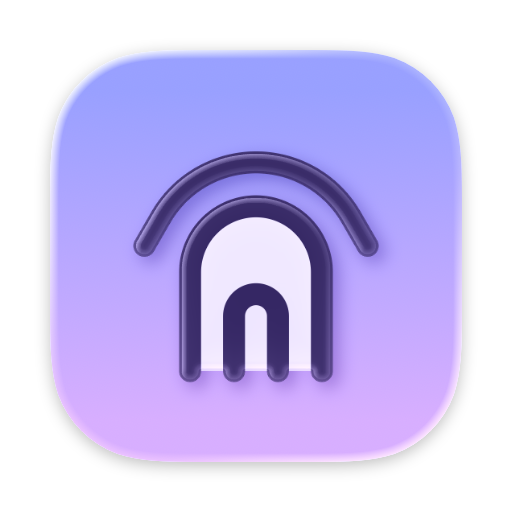
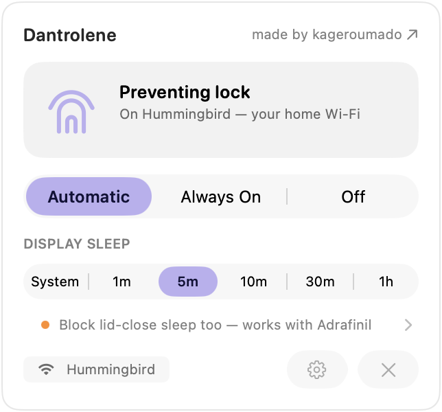
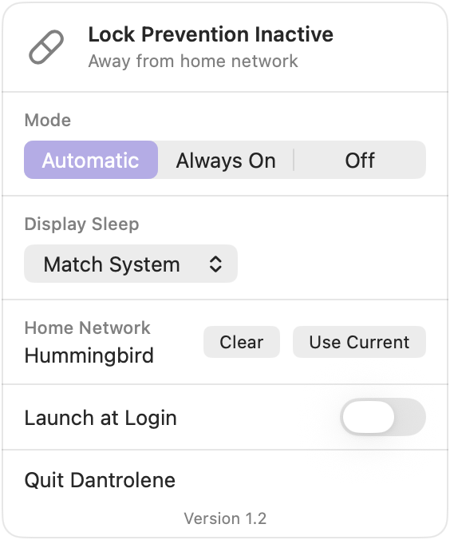

<div align="center">

[](https://kagerou.glass)



# dantrolene

**rx no. 003 ・ dan·tro·lene /ˈdæntrəliːn/ ・ a muscle relaxant for the lock screen ♡**

[](https://kagerou.glass/dantrolene/)
[](https://x.com/kageroumado)
[](#requirements)

<a href="https://apps.apple.com/us/app/dantrolene-no-lock-at-home/id6790834557?mt=12"></a>

<table>
  <tr>
    <td align="center"><picture><source media="(prefers-color-scheme: dark)" srcset=".github/dantrolene-home-dark.png"></picture><br><sub><b>home</b> ・ on your wifi — the screen never locks</sub></td>
    <td align="center"><picture><source media="(prefers-color-scheme: dark)" srcset=".github/dantrolene-away-dark.png"></picture><br><sub><b>away</b> ・ any other network, it locks like it should</sub></td>
  </tr>
</table>

</div>

> **服用注意 ・ for the Macs that live at home.**
>
> Lock timeouts make sense on a train, in an office, anywhere a stranger might walk past. At home
> they're a reflex with no predator: the screen seizes up mid-paragraph, mid-movie, and asks for
> the password it asked an hour ago. Dantrolene, the drug, is what you give a body that clenches
> when it shouldn't. The app watches which WiFi you're on — on the network you call home, the lock
> chain never starts. Everywhere else, the reflex stays. ♡

---

Your Mac stops locking **while you're on your home WiFi** — and locks like it should everywhere else.

Dantrolene is a macOS menu bar app that holds a display power assertion while you're on a network
you designated as home, so the idle screen lock never fires. It still *looks* like display sleep:
after your usual timeout the screen dims and goes dark, and any activity brings it back instantly —
with no password between you and the sentence you were reading.

## Features

- **Automatic, by network.** Set your home WiFi once; lock prevention follows you on and off it. Always On and Off modes when you want manual control.
- **Display sleep simulation.** The display still dims and turns off on your schedule (or matching the system setting) — it just never locks. Restores instantly on activity.
- **Conflict-aware.** When another app already holds a display assertion — a video call, a presentation — Dantrolene notices and backs off.
- **Lid-close sleep blocking.** With [Adrafinil](https://github.com/kageroumado/adrafinil) installed, Dantrolene can also hold the Mac awake through a closed lid while at home, releasing the moment you leave.
- **Sleep/wake aware.** Releases its assertions on system sleep and re-evaluates on wake.
- **Launch at Login,** then forget it exists.
- **Nothing phones home.** No server, no analytics, no network connections — the WiFi name is checked on-device. See [PRIVACY.md](PRIVACY.md).

## Editions

Dantrolene ships in two editions with the same version number; the Settings page footer shows which one you're running.

| | GitHub (this repo) | Mac App Store |
|---|---|---|
| Display sleep simulation | True backlight control via `DisplayServices` | Black overlay windows (panel stays lit) |
| Keyboard backlight dimming | Yes | No |
| Lid-close sleep blocking via Adrafinil | Yes | No (sandboxing prevents talking to the Adrafinil daemon) |
| Sandboxed | No | Yes |

The GitHub edition is the full-featured one; the [App Store edition](https://apps.apple.com/us/app/dantrolene-no-lock-at-home/id6790834557?mt=12) ($2.99) is the convenient way to get the core WiFi-based lock prevention with store installs and updates — and it's the tip jar: buying it pays for the time that keeps the free edition alive. ♡

## How it works

macOS locks the screen when the display sleeps due to idle timeout. Dantrolene prevents this by
holding an IOKit power assertion (`PreventUserIdleDisplaySleep`) that tells the system not to
idle-sleep the display. Since the display never idle-sleeps, the lock chain never fires.

To avoid the display staying lit forever, Dantrolene includes a **display sleep simulator** that
mimics the native behavior: after a configurable idle timeout (or matching your system setting),
it dims the display to near-zero, then turns it off entirely. Any user activity instantly restores
the original brightness. The GitHub edition drives the real backlight through Apple's private
`DisplayServices.framework` (and `KeyboardBrightnessClient` for the keyboard); the App Store
edition simulates the same sequence with black overlay windows, since sandboxed apps can't touch
private frameworks.

WiFi SSID detection uses CoreWLAN with CoreLocation authorization (macOS requires Location
Services permission to read the current SSID). The network name is compared on-device and never
leaves your Mac.

> **服用注意 ・ side effects.** An SSID is a name, not a proof: anyone can call their hotspot what
> you call home, so treat this as comfort, not security. The GitHub edition's backlight dimming
> rides on private frameworks, so a macOS update may break it someday.

## Requirements

- **macOS Tahoe 26+**
- **Location Services permission** (required by macOS to read the WiFi SSID)
- **Xcode 26+** to build, with Swift 6 strict concurrency enabled

## Download

- **[Mac App Store](https://apps.apple.com/us/app/dantrolene-no-lock-at-home/id6790834557?mt=12)** — $2.99, sandboxed, updated through the store. The free build below is the same idea with more reach, so paying here is a choice, not a toll — it funds the work, and it's genuinely appreciated.
- **[GitHub Releases](https://github.com/kageroumado/dantrolene/releases/latest)** — free: a signed, notarized disk image of the full-featured edition. Open it, drag **Dantrolene** to Applications, and launch.

## Setup

1. Launch the app — a small house appears in the menu bar
2. Grant Location Services when prompted
3. Click the house → **Choose…** → **Set as Home** on the network you're connected to
4. Enable **Launch at Login** (behind the gear) and forget it exists

When you leave home, the house folds shut into a padlock — the tell that your Mac locks
normally again.

## Building

```sh
git clone https://github.com/kageroumado/dantrolene.git
cd dantrolene
open Dantrolene.xcodeproj
```

Two schemes: **Dantrolene** (the GitHub edition) and **Dantrolene-AppStore** (sandboxed; the
`APPSTORE` compilation condition swaps the private-framework display sleep for overlay windows
and compiles out the Adrafinil integration). Select one, set your development team, Run.

For a headless compile check without local signing identities:

```sh
xcodebuild -project Dantrolene.xcodeproj -scheme Dantrolene -configuration Debug \
  -destination 'generic/platform=macOS' \
  CODE_SIGNING_ALLOWED=NO CODE_SIGNING_REQUIRED=NO CODE_SIGN_IDENTITY='' build
```

## The name

Named after [dantrolene](https://en.wikipedia.org/wiki/Dantrolene), the muscle relaxant that
prevents muscles from locking up — this app prevents your screen from locking up. Same shelf as
[Adrafinil](https://github.com/kageroumado/adrafinil), a different prescription: Adrafinil keeps
the whole machine awake while agents work; Dantrolene only keeps the screen unlocked while you're
home.

## License

[MIT](LICENSE). Do whatever you want, no warranty.

## Acknowledgements

Built by [@kageroumado](https://x.com/kageroumado), dispensed at
[kagerou.glass](https://kagerou.glass). The mark is a wifi signal that grew a roof: at home the
arcs stand open as a house; anywhere else they fold shut into a padlock.
